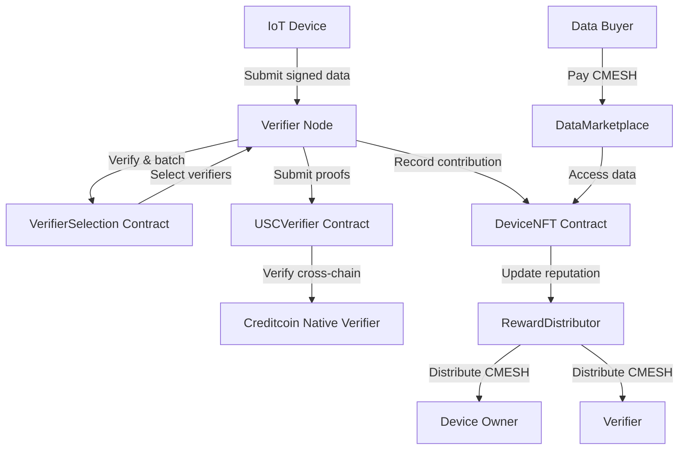

# CreditMesh: Decentralized Physical Infrastructure Network (DePIN) on Creditcoin

[](https://opensource.org/licenses/MIT)
[](https://soliditylang.org/)
[](https://hardhat.org/)
[](https://creditcoin.org/)

**CreditMesh** is a DePIN (Decentralized Physical Infrastructure Network) that enables owners of IoT devices (sensors, gateways, satellites, storage nodes) to monetize their data by participating in a decentralized, incentivized network. Built on **Creditcoin**, it leverages Universal Smart Contracts (USC) for cross-chain verification, a native staking mechanism, and a DAO for governance.


---

## ✨ Features

- **Device NFTs** – Each physical device is represented by an ERC721 token holding on-chain reputation, stake, and earnings history.
- **Staking & Slashing** – Device owners and verifiers stake CMESH tokens; malicious actors are slashed.
- **Verifier Network** – Randomly selected verifiers validate data submissions; they earn rewards for honest work.
- **Epoch-based Rewards** – Daily distribution of CMESH to devices and verifiers based on contribution and reputation.
- **Data Marketplace** – Buy and sell verified data streams directly on-chain.
- **Creditcoin Integration** – Use CTC for staking, USC for cross-chain verification, and the DEX for token swaps.
- **DAO Governance** – Community-controlled parameter updates and treasury management.

---

## 🏗️ Architecture

### High‑Level Flow



### Smart Contract Layer

| Contract | Description |
|----------|-------------|
| **DeviceNFT** | ERC721 token for device identity; stores type, reputation, stake, earnings. |
| **StakingPool** | Manages CMESH stakes for devices and verifiers; implements slashing. |
| **VerifierSelection** | Randomly selects verifiers each epoch using on-chain randomness. |
| **RewardDistributor** | Distributes epoch rewards based on contribution and reputation. |
| **DataMarketplace** | Allows listing and purchasing of verified data streams. |
| **USCVerifier** | Integrates with Creditcoin’s native verifier precompile (0x0FD2) for cross-chain data verification. |
| **CreditMeshToken** | ERC20 token (CMESH) used for staking, rewards, and marketplace. |
| **CreditMeshGovernor** | DAO governor with timelock control for protocol parameters. |

---

## 🧰 Tech Stack

- **Blockchain**: Creditcoin (EVM-compatible), Solidity 0.8.19
- **Smart Contract Dev**: Hardhat, OpenZeppelin
- **Off‑chain Verifier**: Node.js, ethers.js, creditcoin-js
- **Frontend**: React, TailwindCSS, ethers.js
- **Storage**: IPFS for device metadata
- **Testing**: Mocha, Chai, Hardhat network

---

## 🚀 Getting Started

### Prerequisites

- Node.js v18+
- npm or yarn
- Hardhat (`npm install -g hardhat`)
- A Creditcoin testnet account with some tCTC (faucet available at [https://faucet.testnet.creditcoin.network](https://faucet.testnet.creditcoin.network))

### Installation

1. Clone the repository:
   ```bash
   git clone https://github.com/your-org/creditmesh.git
   cd creditmesh
   ```

2. Install dependencies:
   ```bash
   npm install
   ```

3. Create a `.env` file based on `.env.example`:
   ```bash
   cp .env.example .env
   # Add your private key and RPC endpoints
   ```

### Deployment

Deploy all contracts to Creditcoin testnet:

```bash
npx hardhat run scripts/deploy.js --network creditcoinTestnet
```

This will deploy:
- CreditMeshToken
- DeviceNFT
- StakingPool
- VerifierSelection
- RewardDistributor
- DataMarketplace
- USCVerifier
- CreditMeshGovernor & Timelock

The deployment script outputs contract addresses – save them for later use.

---

## 📡 Usage

### 1. Register a Device (as Owner)

```javascript
// Example using ethers.js
const deviceNFT = new ethers.Contract(DEVICE_NFT_ADDRESS, DeviceNFT_ABI, signer);
const tx = await deviceNFT.registerDevice(
  ownerAddress,
  0, // Sensor
  "did:creditmesh:device:1234",
  "ipfs://QmYourMetadataHash"
);
await tx.wait();
console.log(`Device registered with ID: ${tx.events[0].args.tokenId}`);
```

### 2. Stake CMESH for the Device

```javascript
// Approve StakingPool to spend CMESH
const cmesh = new ethers.Contract(CMESH_ADDRESS, CMESH_ABI, signer);
await cmesh.approve(STAKING_POOL_ADDRESS, ethers.utils.parseEther("100"));

// Stake
const stakingPool = new ethers.Contract(STAKING_POOL_ADDRESS, StakingPool_ABI, signer);
await stakingPool.stakeForDevice(tokenId, ethers.utils.parseEther("100"));
```

### 3. Submit Data (Device Side)

Devices submit signed data to a verifier node (off-chain) or directly to a L2 chain. For testing, use the mock data generator:

```typescript
import { generateMockData } from './mockDataGenerator';

const data = generateMockData('iot', deviceId);
// Send to your verifier endpoint
await fetch('https://your-verifier-node.com/submit', {
  method: 'POST',
  body: JSON.stringify(data)
});
```

### 4. Verify Data (Verifier Node)

The verifier node (see `verifier-node/`) listens for submissions, validates signatures, and periodically submits batches to the `USCVerifier` contract.

```bash
cd verifier-node
npm start
```

### 5. Claim Rewards

After an epoch ends, device owners and verifiers can claim rewards:

```javascript
const rewardDistributor = new ethers.Contract(REWARD_DISTRIBUTOR_ADDRESS, RewardDistributor_ABI, signer);
await rewardDistributor.distributeDeviceReward(tokenId);
```

### 6. List Data for Sale

```javascript
const marketplace = new ethers.Contract(MARKETPLACE_ADDRESS, DataMarketplace_ABI, signer);
await marketplace.listData(tokenId, ethers.utils.parseEther("0.1"), 1000, 7 * 86400); // 1000 data points at 0.1 CMESH each, valid 7 days
```

---

## 🔗 Creditcoin Integration Points

| Feature | Implementation |
|---------|----------------|
| **Native Verifier** | `USCVerifier.sol` calls precompile at `0x0FD2` to verify Ethereum transactions. |
| **CTC Token** | `CreditMeshToken` can be swapped for CTC via the DEX Router SDK. |
| **Staking** | StakingPool can be extended to nominate Creditcoin validators. |
| **GCRE Swap** | Verifiers can swap testnet GCRE for CTC using the `requestCollectCoinsV2` extrinsic. |
| **DEX Router** | Use `@gluwa/creditcoin-dex-router-sdk` to swap CMESH ↔ CTC. |

See [creditcoin-integration.md](./docs/creditcoin-integration.md) for detailed code examples.

---

## 🧪 Testing

Run the full test suite:

```bash
npx hardhat test
```

For coverage:

```bash
npx hardhat coverage
```

### Example Test (Device Registration)

```javascript
describe("DeviceNFT", function () {
  it("Should register a new device", async function () {
    const [owner] = await ethers.getSigners();
    const DeviceNFT = await ethers.getContractFactory("DeviceNFT");
    const deviceNFT = await DeviceNFT.deploy();
    await deviceNFT.deployed();

    await expect(deviceNFT.registerDevice(owner.address, 0, "did:test", "ipfs://test"))
      .to.emit(deviceNFT, "DeviceRegistered")
      .withArgs(0, owner.address, 0);
  });
});
```

---

## 🗺️ Roadmap

- **Q1 2026** – Hackathon prototype, testnet launch ✅
- **Q2 2026** – Pilot with 50 devices, verifier incentives
- **Q3 2026** – Mainnet deployment, CEIP fast‑track, data marketplace
- **Q4 2026** – 500+ devices, cross-chain expansion via USC

---

## 🤝 Contributing

We welcome contributions! Please see [CONTRIBUTING.md](./CONTRIBUTING.md) for guidelines.

---

## 📄 License

This project is licensed under the MIT License – see the [LICENSE](LICENSE) file for details.

---

## 🙏 Acknowledgements

- Built for the **BUIDL CTC Hackathon** sponsored by Creditcoin.
- Uses OpenZeppelin contracts and Hardhat.
- Inspired by the real‑world potential of DePIN and Creditcoin’s unique cross-chain capabilities.

---

*For questions or support, reach out on [Discord](https://discord.gg/creditcoin) or open an issue.*

